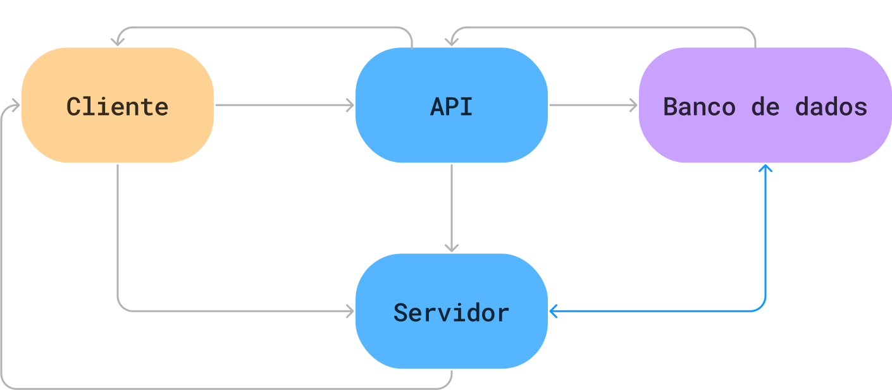
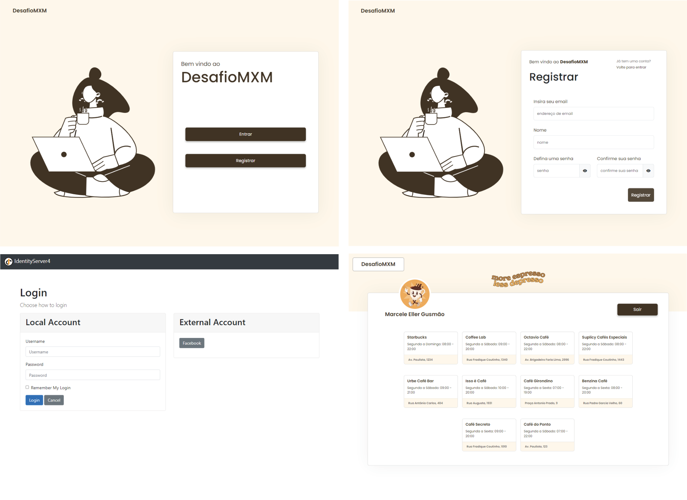
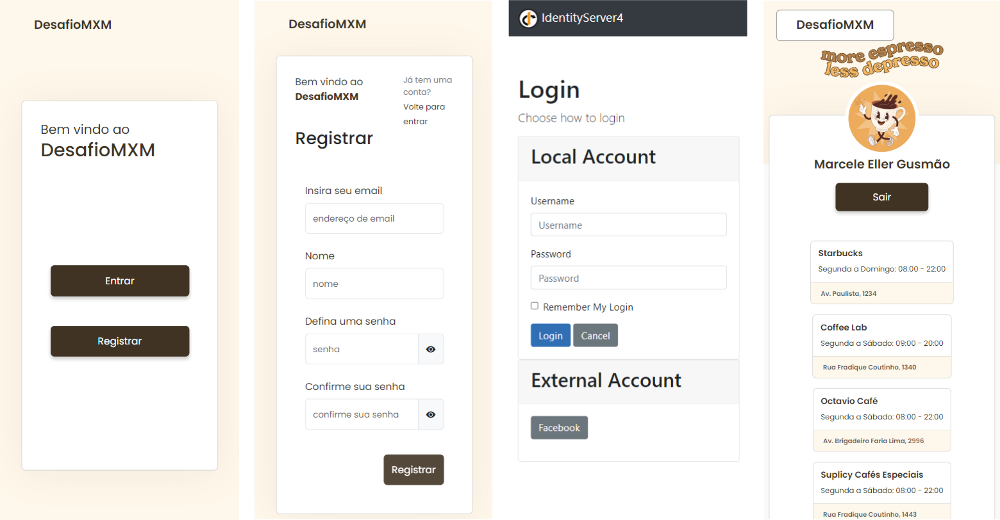

[PROJECT__BADGE]: https://img.shields.io/badge/📱Visite_este_projeto-000?style=for-the-badge&logo=project
[PROJECT__URL]: https://desafiomxm.vercel.app/

  

  
  
  

  

<h4 align="center">
   ☕ DesafioMXM ☕
</h4>

 <a href="#-sobre-o-projeto">Sobre</a> •
 <a href="#-funcionalidades">Funcionalidades</a> •
 <a href="#-estrutura-do-projeto">Estrutura do projeto</a> •
 <a href="#-fluxo">Fluxo</a> •
 <a href="#-layout">Layout</a> •
<a href="#-tecnologias">Tecnologias</a>
<a href="#-autoria">Autoria</a>

## 💻 Sobre o projeto

☕ DesafioMXM  - é um desafio para o processo seletivo da MXM Sistemas.
Desafio: Criar um projeto utilizando Identity server para autenticação através do Facebook.
A maior dificuldade foi entender o funcionamento do IdentityServer4, foi minha primeira vez lidando com uma aplicação em camadas e realizando o deploy pelo Azure.

[![project][PROJECT__BADGE]][PROJECT__URL]

---

## ⚙️ Funcionalidades

- [x] Cadastro:
  - O usuário consegue criar sua conta, informando os dados necessários para a criação de uma conta no sistema. 
- [x] Login:
  - Após cadastrado, o login é realizado através do Identity Server, que trata-se de um SSO (Single Sign On) ou login único. Geralmente utilizado para centralizar a autenticação de múltiplas aplicações e serviços. O login pelo Facebook também foi implementado.
- [x] Página inicial:
  - Após o login, o usuário é direcionado para a página inicial, onde seu nome será exibido. Nesta página é feita a requisição para a API, protegida pelo AccessToken emitido pelo IS. Para fins de teste, a API retorna uma lista de cafeterias.

---

## 📁 Estrutura do projeto

O projeto foi estruturado em quatro camadas:

- DataAccess: Usado para persistência de dados, fazendo a separação das regras de acesso ao banco de dados do restante da aplicação. A vantagem do seu uso é ser possível reutilizar suas operações em diferentes partes da aplicação, reduzindo a duplicidade de código e aumentando a consistência.
- API: Projeto para expor os dados do banco de dados. Nesta aplicação, a API tem o único intuito de listar cafeterias de São Paulo. Seu propósito é apenas para fins de testes, utilizando o AccessToken emitido pelo Servidor.
- Servidor: Detém toda configuração do IdentityServer4: views, controllers, migrations e as definições das entidades utilizando a biblioteca ASPNET Core Identity.
- Cliente: Projeto em angular utilizando a biblioteca angular-auth-oidc-client para conexão com o servidor.

---

## 🔄 Fluxo

O fluxograma abaixo foi realizado durante o estudo do fluxo do IdentityServer, foi uma forma de ajudar no entendimento de como o projeto deveria se estruturar.

---

## 🎨 Layout

### Web

### Mobile

## 🛠 Tecnologias

As seguintes ferramentas foram usadas na construção do projeto:

#### **FrontEnd**  ([Angular](https://angular.io/)  +  [Bootstrap](https://getbootstrap.com/))

#### **BackEnd**  ([.NET 6](https://dotnet.microsoft.com/en-us/))

#### **Banco de dados**  ([SQLServer](https://www.microsoft.com/pt-br/sql-server/sql-server-downloads))

## Autoria
|  Marcele Eller Gusmão Moura  <a href="https://www.linkedin.com/in/marceleeller/"> |
| ----------- |